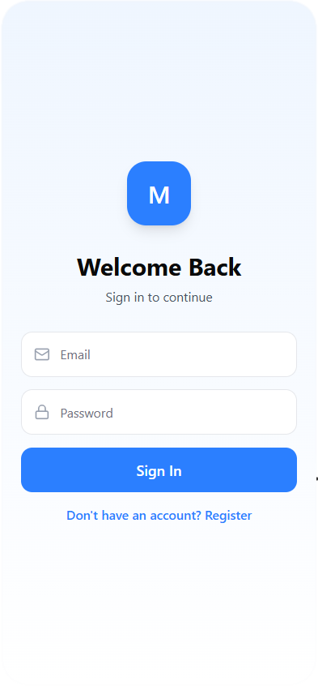
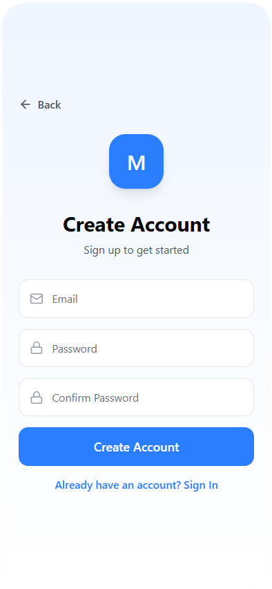
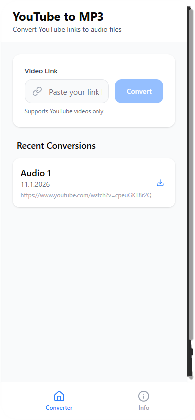
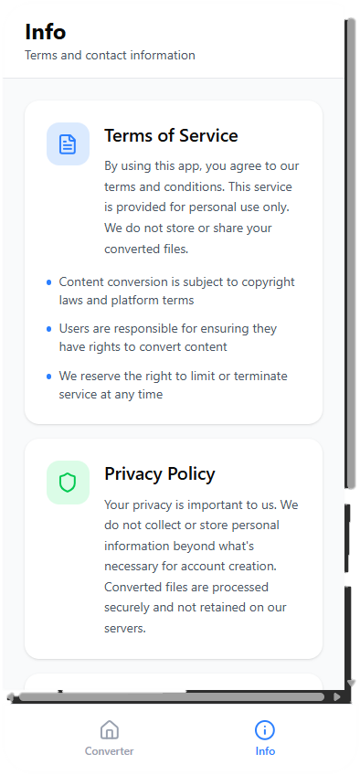

# Kompetenznachweis 335 - Mobile App

Mobile-App mit erarbeiteten Kompetenzen aus dem Modul 335.

Ich habe mich für einen YouTube zu MP3 Converter entschieden, da ich ein Teil des Backends bereits aufgesetzt habe und nun eine App damit bauen will.

## 1 Anforderungen und Planung

### A. Idee mit Skizze

Die Skizzen sollen den Aufbau und die Funktionalitäten darstellen, das Design ist noch nicht definiert und wird eher schlicht ausfallen.

1. Login Screen 

    Als erstes erscheint ein Login Screen über den man sich mit seiner E-Mail Adresse und dem Passwort anmelden kann. Zusätzlich gibt es einen Register-Button um sich zu registrieren.

    

2. Register Screen 

    Wenn man noch kein Login hat kann man sich über den Register-Button registrieren. Es wird lediglich eine E-Mail-Adresse und ein Passwort verlangt. Die Authentifizierung und Speicherung der User ist über Firebase geplant.

    

3. Converter Screen 

    Nach dem Login wird man auf die Converter-Seite geleitet, welches eines von den zwei einzigen Tabs der Anwendung ist. Man kann einen YouTube Link einfügen und diesen in MP3 konvertieren und dann herunterladen. Das Ziel ist es das Video zu konvertieren, in Firebase zu speichern und dem User dann als Download zur Verfügung zu stellen.

    

4. Info Screen

    Im zweiten Tab, dem Info Screen, sollen die Nutzungsbedingungen, Kontakt und sonstige Informationen angezeigt werden.

    

### B. Komponenten

Der Kompetenznachweis fordert, dass mindestens zwei Komponenten (wie Sensoren, persistente Speicherung oder Authentifizierung) eingebaut werden.

Ich habe mich für folgende Komponenten entschieden:

1. Persistente Speicherung: Firebase

    Die konvertierten Videos sollen auf Firebase gespeichert werden, so dass diese vom User anschliessend heruntergeladen werden können.

2. Authentifizierung: Firebase

    Die App soll eine Authentifizierung haben, welche über Firebase erfolgt.

### C. Testplan

| Bereich   | Test                                                                                                          | Erwartetes Ergebnis                                                                                                    | Ergebnis |
|-----------|---------------------------------------------------------------------------------------------------------------|------------------------------------------------------------------------------------------------------------------------|----------|
| Login     | Login mit ungültigen Daten                                                                                    | Login fehlgeschlagen                                                                                                   | Offen    |
| Login     | Login mit korrekten Daten                                                                                     | Login erfolgreich, Weiterleitung auf Startseite                                                                        | Offen    |
| Register  | Klick auf Register-Button                                                                                     | Weiterleitung auf Registrierungsseite                                                                                  | Offen    |
| Register  | Registrierung mit ungültigen Daten (Passwortanforderungen, Passwortübereinstimmung oder E-Mail-Syntax falsch) | Registrierung fehlgeschlagen                                                                                           | Offen    |
| Register  | Registrierung mit gültigen Daten                                                                              | Registrierung erfolgreich, User erstellt und Weiterleitung auf Startseite                                              | Offen    |
| Register  | Registrierung mit bestehender E-Mail-Adresse                                                                  | Registrierung fehlgeschlagen (optimal mit aussagekräftigem Error)                                                      | Offen    |
| Converter | Konvertierung mit ungültiger Eingabe (alles ausser YouTube-Video Links sind ungültig)                         | Konvertierung fehlgeschlagen                                                                                           | Offen    |
| Converter | Injection (SQL-Injection, XSS-Injection)                                                                      | Konvertierung fehlgeschlagen und Eingaben werden nicht ausgeführt                                                      | Offen    |
| Converter | Konvertierung mit gültiger Eingabe (gültiger YouTube Link)                                                    | Konvertierung erfolgreich, Video wird in Firebase gespeichert und steht dem User über einen Button zum Download bereit | Offen    |
| Converter | Gültiger YouTube Link mit einem sehr langen Video (Zeitlimit noch offen)                                      | Konvertierung fehlgeschlagen, Timeout                                                                                  | Offen    |
| Info      | Tab öffnen                                                                                                    | Tab lässt sich öffnen und jeder hinterlegte Text ist lesbar und zu erreichen                                           | Offen    |

## 2 Lösungskonzept

### A. Entwicklungskonzept (Framework, App-Typ und Architektur)

* Die Mobile App soll als Hybrid (Cross-Platform) in React Native mit Expo entwickelt werden.
* Das Login und die Registrierung laufen über Firebase.
* Die Konvertierung läuft über eine API die in Python aufgesetzt wird und für die Konvertierung yt_dlp verwendet.
* Das Frontend ruft diese API mit dem YouTube Link auf und erhält eine Erfolgsmeldung mit dem Download Link oder einer Information, wo das Video in Firebase gespeichert wurde, um es anschliessend zu fetchen.

### B. Beschreibung Komponenten

1. Authentifizierung (Firebase Authentication)

    Für den Login- und Registrierungsprozess verwende ich Firebase Authentication. Nutzer:innen können sich mit E-Mail und Passwort registrieren und anschliessend anmelden.
Nach erfolgreicher Authentifizierung liefert Firebase ein User-Objekt (uid, email), das in der App als Identifikator dient. Diese uid wird verwendet, um konvertierte Dateien eindeutig einem User zuzuordnen.

2. Persistente Speicherung (Firebase Storage)

    Für die persistente Speicherung verwende ich Firebase Storage:

    Die konvertierten MP3-Dateien werden in Firebase Storage abgelegt, weil es für Binärdaten/Dateien (MP3) optimiert ist.

